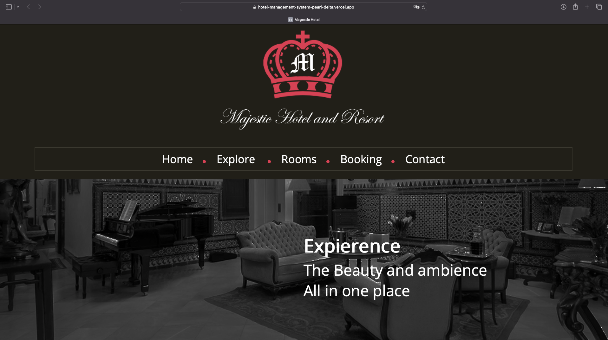
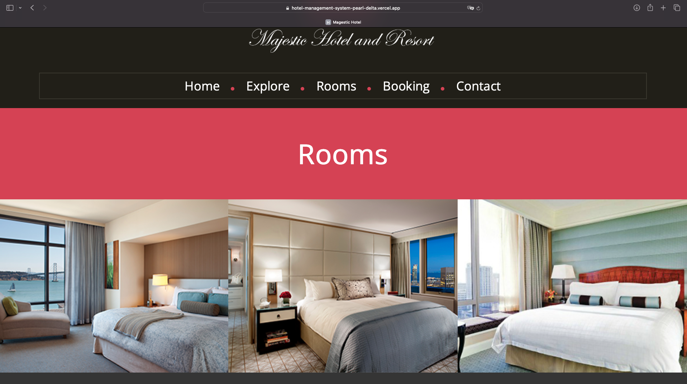
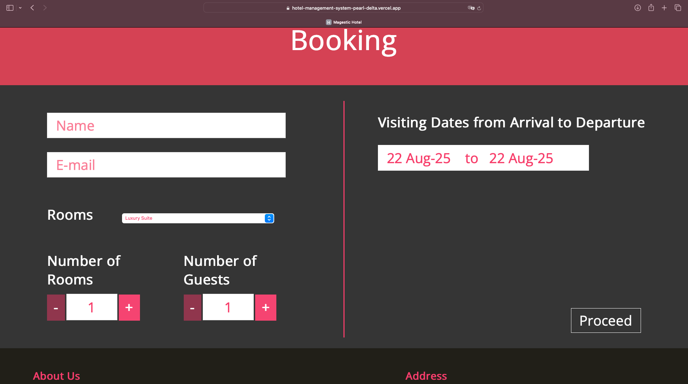

# 🏨 Hotel Management System  

A simple and responsive **Hotel Management System** built with **HTML, CSS, and JavaScript**.  
This project demonstrates a hotel website with features like **room listings, booking, services, and contact information**.  

---

## ✨ Features  
- 🏠 **Beautiful Home Page** – Modern design with navigation bar.  
- 🛏️ **Room Management** – View available rooms and details.  
- 🍽️ **Services Section** – Highlight restaurant and amenities.  
- 📞 **Contact Form** – Easy communication with the hotel.  
- 📱 **Responsive Design** – Works on desktop, tablet, and mobile.  

---

## 📸 Screenshots  

### 🏠 Home Page  
  

### 🛏️ Room Listings  
  
 

### 🍽️ Services  
  
 

---
 ```bash
Hotel-backend/
├─ server.js
├─ package.json
├─ .env.example
├─ README.md
├─ config/db.js
├─ controllers/
│  ├─ authController.js
│  ├─ userController.js
│  ├─ roomController.js
│  └─ bookingController.js
├─ models/
│  ├─ User.js
│  ├─ Room.js
│  └─ Booking.js
├─ routes/
│  ├─ authRoutes.js
│  ├─ userRoutes.js
│  ├─ roomRoutes.js
│  ├─ bookingRoutes.js
│  └─ uploadRoutes.js
├─ middleware/
│  ├─ authMiddleware.js
│  └─ errorMiddleware.js
├─ utils/generateToken.js
├─ data/seed.js
└─ uploads/ (.gitkeep)
 ```


### 🔹 Frontend Setup (Client-side)
1. Clone the client repository:
   ```bash
   git clone https://github.com/your-username/Hotel-Frontend.git
   cd Hotel-Frontend
    ```
2. Install dependencies:
   ```bash
    npm install
   ```
3. Setup environment variablesSetup environment variables:
    ```bash
    VITE_API_URL=http://localhost:5000/api
    ==========================
   ```
4. Start development server:
   ```bash
   npm start
   ```

### 🔹 Backend Setup (Server-side)
1. Clone the server repository:
   ```bash
   git clone https://github.com/tonni59/QuickCart-Server-Side.git
   cd QuickCart-Server-Side
    ```
2. Install dependencies:
   ```bash
   npm install
   ```
3. Create a .env file in the root and add:
   ```bash
    PORT=5000
   NODE_ENV=development
   MONGO_URI=mongodb://localhost:27017/hotel_db
   JWT_SECRET=your_jwt_secret
   CLIENT_URL=http://localhost:3000

   ```
4. Start the server:
   ```bash
   npm run dev

   ```
## 🚀 Deployment  
https://hotel-management-system-pearl-delta.vercel.app
